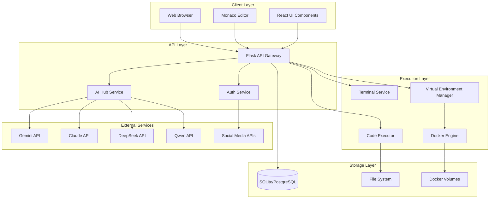
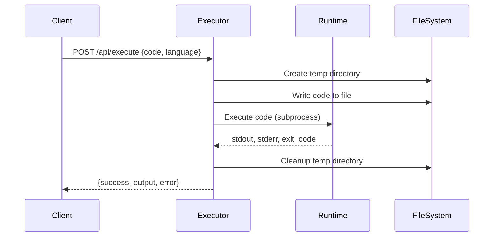
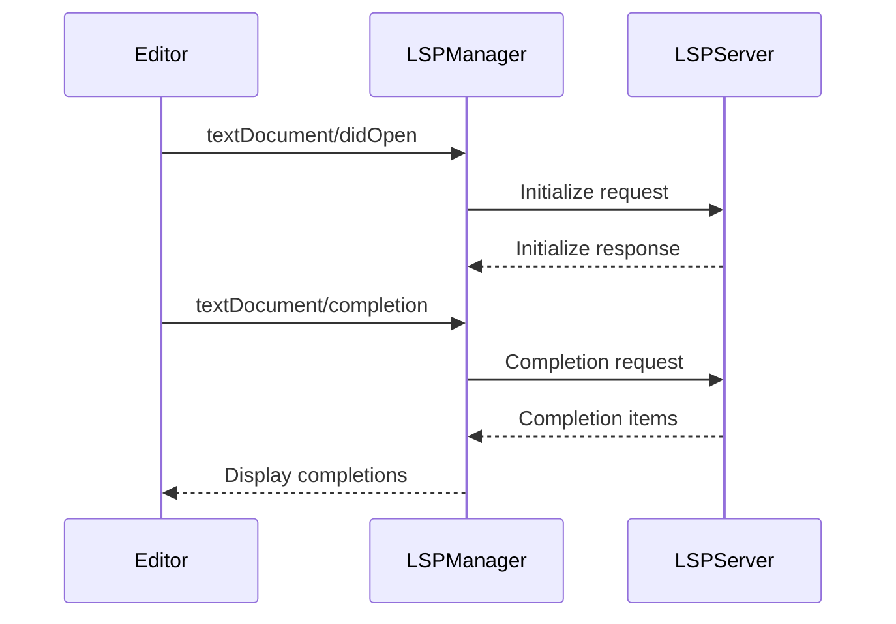

# Design Document: Roolts IDE Platform

## Overview

The Roolts IDE Platform is a comprehensive web-based Integrated Development Environment that provides developers with a complete coding environment accessible through a browser. The platform combines a Monaco-based code editor, multi-language code execution, AI-powered assistance, real-time collaboration, and virtual environment management into a unified experience.

### Key Design Goals

1. **Accessibility**: Provide a full-featured IDE accessible from any device with a web browser
2. **Intelligence**: Integrate multiple AI providers to offer context-aware assistance
3. **Isolation**: Use containerization to provide secure, isolated development environments
4. **Extensibility**: Support VS Code-compatible extensions for customization
5. **Collaboration**: Enable real-time code sharing and pair programming
6. **Performance**: Optimize for responsive editing and fast code execution

### Technology Stack

- **Frontend**: React 18, Monaco Editor, Zustand (state management), Socket.IO (real-time), WebRTC (collaboration)
- **Backend**: Python Flask, SQLAlchemy, JWT authentication, asyncio
- **Execution**: Portable runtimes (Python, Node.js, Java, GCC, Go, Kotlin, .NET, Ruby)
- **Containerization**: Docker for virtual environments
- **AI Integration**: Gemini, Claude, DeepSeek, Qwen, HuggingFace APIs
- **Database**: SQLite (development), PostgreSQL (production)
- **LSP**: Language Server Protocol for code intelligence

## Architecture

### High-Level Architecture



### Component Architecture

The system follows a layered architecture with clear separation of concerns:

1. **Presentation Layer**: React-based UI with Monaco Editor for code editing
2. **API Layer**: Flask REST API with JWT authentication
3. **Business Logic Layer**: Services for AI routing, code execution, file management
4. **Data Layer**: SQLAlchemy ORM with SQLite/PostgreSQL
5. **Infrastructure Layer**: Docker for containerization, portable runtimes for execution

## Components and Interfaces

### 1. Authentication Service

**Responsibility**: User registration, login, JWT token management, OAuth integration

**Key Classes**:
- `User`: User model with password hashing
- `SocialToken`: OAuth token storage for social platforms
- `AuthService`: Authentication logic and token generation

**API Endpoints**:

```
POST   /api/auth/register          - Create new user account
POST   /api/auth/login             - Authenticate and get JWT token
GET    /api/auth/me                - Get current user profile
PUT    /api/auth/profile           - Update user profile
PUT    /api/auth/api-keys          - Store AI API keys
GET    /api/auth/twitter/connect   - Initiate Twitter OAuth
POST   /api/auth/twitter/callback  - Handle Twitter OAuth callback
GET    /api/auth/linkedin/connect  - Initiate LinkedIn OAuth
POST   /api/auth/linkedin/callback - Handle LinkedIn OAuth callback
GET    /api/auth/onedrive/connect  - Initiate OneDrive OAuth
POST   /api/auth/onedrive/callback - Handle OneDrive OAuth callback
GET    /api/auth/connections       - List connected social accounts
DELETE /api/auth/connections/:platform - Disconnect social account
```

**Security Design**:
- Passwords hashed using Werkzeug's `generate_password_hash` (PBKDF2-SHA256)
- JWT tokens signed with HS256 algorithm, 7-day expiration
- API keys stored in database (should be encrypted in production using Fernet or similar)
- OAuth state parameter includes signed user ID to prevent CSRF
- All endpoints except register/login require valid JWT in Authorization header

### 2. Multi-AI Hub Service

**Responsibility**: Route requests to appropriate AI providers, manage API keys, provide intelligent model selection

**Key Classes**:
- `MultiAIService`: Manages multiple AI provider clients
- `AISelector`: Analyzes prompts and selects optimal AI provider
- `AsyncDeepSeekProvider`: Async client for DeepSeek API

**AI Routing Logic**:
```python
def select_model(prompt: str) -> str:
    if contains_code_keywords(prompt):
        return 'deepseek'  # Best for code generation
    elif contains_writing_keywords(prompt):
        return 'claude'    # Best for creative writing
    elif contains_research_keywords(prompt):
        return 'gemini'    # Best for factual information
    elif contains_multilingual(prompt):
        return 'qwen'      # Best for non-English languages
    else:
        return 'gemini'    # Default fallback
```

**API Endpoints**:
```
GET  /api/ai-hub/models          - List available AI models
POST /api/ai-hub/chat            - Send message to AI (auto or manual selection)
POST /api/ai-hub/suggest         - Get typing suggestions
POST /api/ai-hub/analyze-prompt  - Analyze best model for prompt
```

**API Key Priority**:
1. Request-provided API key (highest priority)
2. User-stored API key in database
3. Environment variable API key (fallback)

### 3. Code Execution Service

**Responsibility**: Execute code in multiple languages using portable runtimes, manage temporary execution environments

**Key Classes**:
- `ExecutorService`: Handles code execution requests
- `CompilerManager`: Manages portable compiler/runtime paths
- `RuntimeSetup`: Downloads and configures portable runtimes

**Execution Flow**:



**Supported Languages**:
- **Python**: Portable Python 3.x with pip
- **JavaScript**: Portable Node.js with npm
- **Java**: Portable OpenJDK with javac/java
- **C**: Portable GCC compiler
- **C++**: Portable G++ compiler
- **Go**: Portable Go runtime with go run
- **Kotlin**: Portable Kotlin compiler with kotlinc
- **C#**: Portable .NET SDK with dotnet
- **Ruby**: Portable Ruby runtime

**Portable Runtime Design**:
- Runtimes stored in `backend/compiler/` directory
- Each runtime has a `bin_path` configuration
- `CompilerManager` provides absolute paths to executables
- Environment variables (GOROOT, DOTNET_ROOT) set per execution
- Automatic runtime setup on first use

**API Endpoints**:
```
POST /api/execute/execute    - Execute code in specified language
GET  /api/execute/health     - Health check
GET  /api/execute/languages  - List supported languages
```

**Timeout and Resource Limits**:
- Execution timeout: 60 seconds
- Memory limit: Enforced by OS (no explicit limit in basic version)
- Temporary directory cleanup: Always performed in finally block
- Process isolation: Each execution in separate subprocess

### 4. File Management Service

**Responsibility**: CRUD operations for code files, language detection, file metadata management

**Key Classes**:
- `FileService`: In-memory file storage (production should use database)
- `LanguageDetector`: Maps file extensions to programming languages

**File Model**:
```python
{
    'id': str,              # UUID
    'name': str,            # Filename
    'path': str,            # File path
    'content': str,         # File content
    'language': str,        # Detected language
    'modified': bool,       # Modification status
    'created_at': datetime,
    'updated_at': datetime
}
```

**API Endpoints**:
```
GET    /api/files/           - List all files
POST   /api/files/           - Create new file
GET    /api/files/:id        - Get file by ID
PUT    /api/files/:id        - Update file content/name
DELETE /api/files/:id        - Delete file
POST   /api/files/:id/save   - Mark file as saved
```

**Language Detection**:
- Extension-based detection using mapping dictionary
- Supports 20+ file extensions
- Defaults to 'plaintext' for unknown extensions

### 5. Terminal Service

**Responsibility**: Provide interactive PowerShell terminal, manage command execution, maintain session state

**Key Classes**:
- `TerminalSession`: Manages persistent terminal session with working directory and history
- `TerminalService`: Handles command execution with portable runtimes in PATH

**Session Management**:

- Each user has a default session (session_id='default')
- Sessions maintain working directory state
- Command history stored in memory (last 50 commands)
- cd command handled specially to update session working directory

**Environment Setup**:
```python
def _get_env():
    env = os.environ.copy()
    # Add portable runtime bin paths to PATH
    bin_paths = [python/bin, nodejs/bin, java/bin, gcc/bin, go/bin, ...]
    env["PATH"] = os.pathsep.join(bin_paths) + os.pathsep + env["PATH"]
    # Set special environment variables
    env['GOROOT'] = go_runtime_path
    env['GOPATH'] = compiler_dir/gopath
    return env
```

**API Endpoints**:
```
POST /api/terminal/execute  - Execute command
GET  /api/terminal/cwd      - Get current working directory
POST /api/terminal/cwd      - Set current working directory
GET  /api/terminal/history  - Get command history
POST /api/terminal/clear    - Clear command history
```

**Command Execution**:
- Uses PowerShell with `-NoProfile` flag
- Timeout: 120 seconds (longer than code execution for package installs)
- Captures stdout and stderr separately
- Returns exit code for success/failure indication

### 6. Virtual Environment Manager

**Responsibility**: Create and manage Docker-based isolated development environments, execute commands in containers

**Key Classes**:
- `VirtualEnvironment`: Database model for environment metadata
- `DockerManager`: Manages Docker container lifecycle
- `SecurityValidator`: Validates commands and environment names
- `PackageManager`: Handles package installation (npm, pip, apt)
- `FileManager`: Manages files within containers

**Environment Types**:
- **nodejs**: Node.js runtime with npm
- **python**: Python runtime with pip
- **fullstack**: Node.js + Python + PostgreSQL
- **cpp**: GCC/G++ compiler with build tools

**Docker Container Design**:
```dockerfile
# Example: Node.js environment
FROM node:18-alpine
WORKDIR /workspace
RUN apk add --no-cache git
VOLUME /workspace
CMD ["tail", "-f", "/dev/null"]  # Keep container running
```

**Resource Limits**:
- CPU: 1.0 cores (configurable per environment)
- Memory: 512 MB (configurable per environment)
- Disk: 1024 MB (configurable per environment)
- Idle timeout: 30 minutes (auto-stop)

**API Endpoints**:
```
POST   /api/virtual-env/environments              - Create environment
GET    /api/virtual-env/environments              - List environments
GET    /api/virtual-env/environments/:id          - Get environment details
POST   /api/virtual-env/environments/:id/start    - Start environment
POST   /api/virtual-env/environments/:id/stop     - Stop environment
DELETE /api/virtual-env/environments/:id          - Destroy environment
POST   /api/virtual-env/environments/:id/execute  - Execute command
GET    /api/virtual-env/environments/:id/logs     - Get execution logs
POST   /api/virtual-env/environments/:id/install  - Install packages
GET    /api/virtual-env/environments/:id/packages - List packages
GET    /api/virtual-env/environments/:id/files    - List files
GET    /api/virtual-env/environments/:id/files/:path - Read file
PUT    /api/virtual-env/environments/:id/files/:path - Write file
DELETE /api/virtual-env/environments/:id/files/:path - Delete file
POST   /api/virtual-env/environments/:id/mkdir    - Create directory
```

**Security Validation**:

```python
DANGEROUS_COMMANDS = [
    'rm -rf /',
    'format',
    'del /f',
    'mkfs',
    ':(){ :|:& };:',  # Fork bomb
    'dd if=/dev/zero',
]

def validate_command(command: str) -> (bool, str, str):
    for dangerous in DANGEROUS_COMMANDS:
        if dangerous in command.lower():
            return False, 'critical', f'Blocked dangerous command: {dangerous}'
    return True, 'safe', 'Command validated'
```

**Logging**:
- All environment operations logged to `EnvironmentLog` table
- Includes action_type, command, status, output, execution_time
- Used for audit trail and debugging

### 7. Extension System

**Responsibility**: Load and manage VS Code-compatible extensions, proxy extension requests

**Key Classes**:
- `ExtensionLoader`: Loads extensions from extensions_data directory
- `ExtensionProxy`: Proxies requests to extension servers
- `ExtensionRegistry`: Maintains registry of installed extensions

**Extension Structure**:
```
extensions_data/
├── publisher.extension-name/
│   ├── package.json          # Extension manifest
│   ├── extension.js          # Extension code
│   └── ...
```

**Extension Manifest (package.json)**:
```json
{
  "name": "extension-name",
  "publisher": "publisher",
  "version": "1.0.0",
  "engines": {
    "vscode": "^1.60.0"
  },
  "contributes": {
    "languages": [...],
    "themes": [...],
    "commands": [...]
  }
}
```

**API Endpoints**:
```
GET  /api/extensions/          - List available extensions
POST /api/extensions/install   - Install extension
GET  /api/extensions/:id       - Get extension details
POST /api/extensions/:id/proxy - Proxy request to extension
```

**Extension Loading**:
1. Scan extensions_data directory
2. Parse package.json for each extension
3. Register language contributions with Monaco
4. Register theme contributions
5. Register command contributions

### 8. Language Server Protocol Integration

**Responsibility**: Provide code intelligence (completion, hover, diagnostics) via LSP servers

**Key Classes**:
- `LSPManager`: Manages LSP server lifecycle
- `LSPClient`: Communicates with LSP servers via JSON-RPC

**Supported LSP Servers**:
- **Python**: Pylance or pyright
- **JavaScript/TypeScript**: typescript-language-server
- **C/C++**: clangd
- **Java**: eclipse.jdt.ls
- **Go**: gopls

**LSP Communication**:


**LSP Features**:
- **Completion**: Context-aware code completion
- **Hover**: Type information and documentation
- **Diagnostics**: Real-time error and warning detection
- **Go to Definition**: Navigate to symbol definition
- **Find References**: Find all symbol references
- **Rename**: Rename symbols across files

**API Endpoints**:
```
POST /api/lsp/initialize       - Initialize LSP server
POST /api/lsp/completion       - Get completions
POST /api/lsp/hover            - Get hover information
POST /api/lsp/definition       - Go to definition
POST /api/lsp/references       - Find references
POST /api/lsp/diagnostics      - Get diagnostics
```

### 9. Snippet Management Service

**Responsibility**: Store and retrieve user code snippets

**Key Classes**:
- `Snippet`: Database model for code snippets

**Snippet Model**:
```python
{
    'id': int,
    'user_id': int,
    'title': str,
    'content': str,
    'language': str,
    'description': str,
    'created_at': datetime,
    'updated_at': datetime
}
```

**API Endpoints**:
```
GET    /api/snippets/     - List all snippets
POST   /api/snippets/     - Create snippet
DELETE /api/snippets/:id  - Delete snippet
```

### 10. Real-Time Collaboration Service

**Responsibility**: Enable real-time code sharing, video calls, screen sharing, and chat

**Key Technologies**:
- **Socket.IO**: Real-time bidirectional communication
- **WebRTC**: Peer-to-peer video/audio streaming
- **SimplePeer**: WebRTC wrapper for easier peer connections

**Collaboration Features**:

1. **Video Calling**: WebRTC peer connections with audio/video streams
2. **Screen Sharing**: Capture and stream screen via WebRTC
3. **Remote Control**: Allow peers to control shared screen
4. **Chat**: Real-time text messaging via Socket.IO
5. **Code Sync**: Broadcast code changes to all participants

**Socket.IO Events**:
```javascript
// Client -> Server
socket.emit('join-room', { roomId, userId })
socket.emit('code-change', { roomId, code, fileId })
socket.emit('chat-message', { roomId, message })

// Server -> Client
socket.on('user-joined', { userId, userName })
socket.on('code-update', { code, fileId, userId })
socket.on('chat-message', { message, userId, timestamp })
```

**WebRTC Signaling**:
```javascript
// Offer/Answer exchange via Socket.IO
socket.emit('webrtc-offer', { roomId, offer, targetUserId })
socket.emit('webrtc-answer', { roomId, answer, targetUserId })
socket.emit('webrtc-ice-candidate', { roomId, candidate, targetUserId })
```

## Data Models

### User Model
```python
class User(db.Model):
    id: int (PK)
    email: str (unique, not null)
    password_hash: str (not null)
    name: str
    profile_image: str
    bio: text
    tagline: str
    gemini_api_key: str
    claude_api_key: str
    deepseek_api_key: str
    qwen_api_key: str
    created_at: datetime
    updated_at: datetime
    
    # Relationships
    social_tokens: List[SocialToken]
```

### SocialToken Model
```python
class SocialToken(db.Model):
    id: int (PK)
    user_id: int (FK -> User.id)
    platform: str (twitter, linkedin, onedrive, evernote)
    access_token: str (not null)
    refresh_token: str
    token_type: str
    expires_at: datetime
    platform_user_id: str
    platform_username: str
    created_at: datetime
    updated_at: datetime
```

### VirtualEnvironment Model
```python
class VirtualEnvironment(db.Model):
    id: int (PK)
    user_id: int (FK -> User.id)
    name: str (not null)
    environment_type: str (nodejs, python, fullstack, cpp)
    container_id: str (unique)
    status: str (creating, running, stopped, error, destroyed)
    volume_name: str
    cpu_limit: float (default 1.0)
    memory_limit: int (default 512 MB)
    disk_limit: int (default 1024 MB)
    created_at: datetime
    last_accessed_at: datetime
    destroyed_at: datetime
    
    # Relationships
    logs: List[EnvironmentLog]
    sessions: List[EnvironmentSession]
```

### EnvironmentLog Model
```python
class EnvironmentLog(db.Model):
    id: int (PK)
    environment_id: int (FK -> VirtualEnvironment.id)
    action_type: str (command, install, file_create, file_delete, etc.)
    command: text
    status: str (success, error, blocked)
    output: text
    execution_time: float
    created_at: datetime
```

### Snippet Model
```python
class Snippet(db.Model):
    id: int (PK)
    user_id: int (FK -> User.id, nullable)
    title: str (not null)
    content: text (not null)
    language: str (default 'plaintext')
    description: text
    created_at: datetime
    updated_at: datetime
```

## Correctness Properties

*A property is a characteristic or behavior that should hold true across all valid executions of a system—essentially, a formal statement about what the system should do. Properties serve as the bridge between human-readable specifications and machine-verifiable correctness guarantees.*

Before defining the correctness properties, let me analyze the acceptance criteria from the requirements document to determine which are testable as properties, examples, or edge cases.


### Property Reflection

After analyzing all acceptance criteria, I've identified the following areas where properties can be consolidated:

**Redundancy Analysis**:
1. **Code Execution Properties (4.1-4.8)**: All language-specific execution requirements can be combined into a single property that tests execution works for all supported languages
2. **File CRUD Properties (5.1-5.7)**: File creation, retrieval, update, and deletion can be tested as a round-trip property
3. **Terminal Command Properties (6.1-6.6)**: Terminal operations can be consolidated into fewer properties focusing on command execution and session state
4. **Virtual Environment Properties (7.1-7.14)**: Environment lifecycle operations can be grouped into creation, execution, and cleanup properties
5. **Authentication Properties (1.1-1.6)**: User registration, login, and profile management can be tested as a user lifecycle property

**Properties to Keep**:
- User authentication round-trip (register → login → profile retrieval)
- AI routing correctness (auto-selection based on prompt characteristics)
- Code execution for all languages (consolidated)
- File management round-trip (create → update → retrieve → delete)
- Terminal session state management
- Virtual environment lifecycle
- Security validation (dangerous command blocking)
- JWT token validation
- Snippet management round-trip

### Correctness Properties

#### Property 1: User Authentication Round-Trip
*For any* valid email and password (≥8 characters), creating a user account, then authenticating with those credentials, should return a valid JWT token that can be used to retrieve the user's profile information.

**Validates: Requirements 1.1, 1.2, 1.3**

#### Property 2: Password Hashing Security
*For any* user account, the stored password_hash should never equal the plaintext password, and check_password should return true for the correct password and false for any other password.

**Validates: Requirements 1.1**

#### Property 3: Profile Update Persistence
*For any* authenticated user and any valid profile updates (name, bio, tagline, profile_image), updating the profile then retrieving it should return the updated values.

**Validates: Requirements 1.4**

#### Property 4: API Key Storage and Retrieval
*For any* authenticated user and any set of AI API keys, storing the keys then retrieving the user profile should indicate the keys are present (has_*_key flags).

**Validates: Requirements 1.5**

#### Property 5: Duplicate Email Rejection
*For any* existing user email, attempting to register a new account with the same email should return a 409 conflict error.

**Validates: Requirements 1.6**

#### Property 6: AI Model Auto-Routing
*For any* prompt containing code keywords (def, function, class, import, etc.), sending it with model="auto" should route to DeepSeek. For prompts with writing keywords (essay, story, article), should route to Claude. For research keywords (what is, explain, research), should route to Gemini.

**Validates: Requirements 2.1**

#### Property 7: AI Model Explicit Selection
*For any* prompt and any explicitly specified model (gemini, claude, deepseek, qwen), the request should be sent to that specific AI provider regardless of prompt content.

**Validates: Requirements 2.2**

#### Property 8: AI Model Availability
*For any* configuration of API keys, the available models list should include only providers with valid (non-placeholder) API keys configured.

**Validates: Requirements 2.3**

#### Property 9: Language Detection from Extension
*For any* filename with a recognized extension (.py, .js, .java, .cpp, etc.), the detected language should match the extension mapping. For unrecognized extensions, should default to 'plaintext'.

**Validates: Requirements 3.2**

#### Property 10: File Modified Flag Management
*For any* file, creating it should set modified=false, updating content should set modified=true, and saving should set modified=false.

**Validates: Requirements 3.5, 5.4, 5.7**

#### Property 11: Multi-Language Code Execution
*For any* supported language (Python, JavaScript, Java, C, C++, Go, Kotlin, C#, Ruby) and any valid code in that language, execution should return stdout, stderr, and exit_code within 60 seconds.

**Validates: Requirements 4.1, 4.2, 4.3, 4.4, 4.5, 4.6, 4.7, 4.8**

#### Property 12: Stdin Input Handling
*For any* code that reads from stdin and any input string, executing the code with the input should produce output that reflects the input was received.

**Validates: Requirements 4.9**

#### Property 13: Execution Cleanup
*For any* code execution, after completion the temporary directory created for execution should be removed from the filesystem.

**Validates: Requirements 4.12**

#### Property 14: File Management Round-Trip
*For any* filename and content, creating a file, retrieving it by ID, updating its content, retrieving again, then deleting it should: (1) return the original content on first retrieval, (2) return updated content on second retrieval, (3) remove the file from the list after deletion.

**Validates: Requirements 5.1, 5.3, 5.4, 5.6**

#### Property 15: File List Completeness
*For any* set of created files, the file list should contain all created files with correct metadata (name, path, language, modified status, timestamps).

**Validates: Requirements 5.2**

#### Property 16: File Rename Language Detection
*For any* file, renaming it with a different extension should update the detected language to match the new extension.

**Validates: Requirements 5.5**

#### Property 17: Terminal Command Execution
*For any* safe command (not in dangerous command list), executing it in the terminal should return stdout, stderr, and exit_code within 120 seconds.

**Validates: Requirements 6.1**

#### Property 18: Terminal Working Directory Management
*For any* valid directory path, executing "cd <path>" should update the session's working directory, and subsequent "pwd" or cwd requests should return the new path.

**Validates: Requirements 6.2, 6.3, 6.4**

#### Property 19: Terminal Command History
*For any* sequence of executed commands, the history should contain the last 50 commands with their outputs and timestamps in reverse chronological order.

**Validates: Requirements 6.5**

#### Property 20: Terminal History Clear
*For any* terminal session with command history, clearing the history should result in an empty history list.

**Validates: Requirements 6.6**

#### Property 21: Terminal Portable Runtime Access
*For any* command that requires a portable runtime (python, node, java, gcc, go), executing it should succeed without requiring the runtime to be in the system PATH.

**Validates: Requirements 6.8**

#### Property 22: Virtual Environment Creation
*For any* valid environment name and type (nodejs, python, fullstack, cpp), creating an environment should result in a Docker container being created with status 'stopped' and a unique container_id.

**Validates: Requirements 7.1**

#### Property 23: Virtual Environment Lifecycle
*For any* created environment, starting it should change status to 'running', stopping it should change status to 'stopped', and destroying it should change status to 'destroyed' and remove the container.

**Validates: Requirements 7.3, 7.4, 7.5**

#### Property 24: Virtual Environment Command Execution
*For any* running environment and any safe command, executing the command should return stdout, stderr, exit_code, and execution_time.

**Validates: Requirements 7.6**

#### Property 25: Virtual Environment Operation Logging
*For any* environment operation (create, start, stop, execute, install, file operations), a log entry should be created with action_type, command, status, output, and execution_time.

**Validates: Requirements 7.15**

#### Property 26: Snippet Management Round-Trip
*For any* title, content, language, and description, creating a snippet then retrieving the snippet list should include the created snippet with all provided fields.

**Validates: Requirements 10.1, 10.2**

#### Property 27: Snippet Deletion
*For any* created snippet, deleting it by ID should remove it from the snippet list.

**Validates: Requirements 10.3**

#### Property 28: Snippet Default Language
*For any* snippet created without specifying language, the language field should default to 'plaintext'.

**Validates: Requirements 10.4**

#### Property 29: Dangerous Command Blocking
*For any* command containing dangerous patterns (rm -rf /, format, del /f, mkfs, fork bomb, dd if=/dev/zero), the security validator should block the command and return a security error.

**Validates: Requirements 17.1, 17.2**

#### Property 30: Environment Name Validation
*For any* environment name containing characters other than alphanumeric, hyphens, and underscores, the validation should reject the name with an error.

**Validates: Requirements 17.3**

#### Property 31: JWT Token Validation
*For any* valid JWT token, validation should succeed and return the user_id. For any expired or invalid token, validation should fail.

**Validates: Requirements 17.5, 17.6**

#### Property 32: Code Execution Isolation
*For any* two concurrent code executions, they should run in separate temporary directories and not interfere with each other's files or output.

**Validates: Requirements 18.1**

#### Property 33: Virtual Environment Access Timestamp
*For any* environment, performing any operation (execute, file read, file write) should update the last_accessed_at timestamp.

**Validates: Requirements 18.4**

#### Property 34: AI Response Caching
*For any* identical prompt sent twice within 1 hour, the second request should return a cached response without calling the AI provider.

**Validates: Requirements 18.9**


## Error Handling

### Error Response Format

All API errors follow a consistent JSON format:

```json
{
  "error": "Human-readable error message",
  "code": "ERROR_CODE",
  "details": "Additional error details (optional)"
}
```

### HTTP Status Codes

- **200 OK**: Successful request
- **201 Created**: Resource created successfully
- **400 Bad Request**: Invalid request data or parameters
- **401 Unauthorized**: Missing or invalid authentication token
- **403 Forbidden**: Authenticated but not authorized (e.g., security validation failed)
- **404 Not Found**: Resource not found
- **408 Request Timeout**: Operation exceeded time limit
- **409 Conflict**: Resource already exists (e.g., duplicate email)
- **500 Internal Server Error**: Unexpected server error

### Error Handling Strategies

1. **Code Execution Errors**:
   - Compilation errors: Return compiler output with line numbers
   - Runtime errors: Return stderr with stack trace
   - Timeout errors: Return timeout message with time limit
   - Missing runtime: Attempt automatic setup, then retry

2. **Authentication Errors**:
   - Invalid credentials: Return 401 with generic message (don't reveal if email exists)
   - Expired token: Return 401 with "Token expired" message
   - Missing token: Return 401 with "Authentication required" message

3. **Virtual Environment Errors**:
   - Container creation failure: Return 500 with Docker error details
   - Command execution failure: Return exit code and stderr
   - Security validation failure: Return 403 with blocked command reason

4. **File Operation Errors**:
   - File not found: Return 404 with file ID
   - Invalid path: Return 400 with path validation error
   - Permission denied: Return 403 with permission error

5. **AI Provider Errors**:
   - API key missing: Return 400 with "API key not configured" message
   - API rate limit: Return 429 with retry-after header
   - API error: Return 500 with provider error message

### Logging Strategy

All errors are logged to `backend_log.txt` with:
- Timestamp
- Error type and message
- Stack trace
- Request context (endpoint, user_id, parameters)

## Testing Strategy

### Dual Testing Approach

The Roolts IDE Platform requires both unit testing and property-based testing for comprehensive coverage:

**Unit Tests**: Focus on specific examples, edge cases, and error conditions
- Authentication flows with specific credentials
- File operations with specific filenames
- Code execution with specific code samples
- Error handling with specific invalid inputs
- Integration points between components

**Property-Based Tests**: Verify universal properties across all inputs
- User authentication works for all valid email/password combinations
- Code execution works for all valid code in supported languages
- File management works for all valid filenames and content
- Security validation blocks all dangerous command patterns
- JWT validation works for all token states (valid, expired, invalid)

### Property-Based Testing Configuration

**Framework**: Use `hypothesis` for Python backend tests

**Configuration**:
- Minimum 100 iterations per property test
- Each test tagged with: `Feature: roolts-ide-platform, Property N: <property_text>`
- Generators for: emails, passwords, filenames, code samples, commands, API keys

**Example Property Test**:
```python
from hypothesis import given, strategies as st
import pytest

@given(
    email=st.emails(),
    password=st.text(min_size=8, max_size=100)
)
def test_property_1_user_authentication_round_trip(email, password):
    """
    Feature: roolts-ide-platform, Property 1: User Authentication Round-Trip
    For any valid email and password, creating a user account, then 
    authenticating with those credentials, should return a valid JWT token 
    that can be used to retrieve the user's profile information.
    """
    # Create user
    response = client.post('/api/auth/register', json={
        'email': email,
        'password': password,
        'name': 'Test User'
    })
    assert response.status_code == 201
    
    # Authenticate
    response = client.post('/api/auth/login', json={
        'email': email,
        'password': password
    })
    assert response.status_code == 200
    token = response.json['token']
    
    # Retrieve profile
    response = client.get('/api/auth/me', headers={
        'Authorization': f'Bearer {token}'
    })
    assert response.status_code == 200
    assert response.json['user']['email'] == email
```

### Unit Testing Focus Areas

1. **Authentication Edge Cases**:
   - Password too short (< 8 characters)
   - Invalid email format
   - Duplicate email registration
   - Expired JWT token
   - Invalid JWT signature

2. **Code Execution Edge Cases**:
   - Empty code
   - Code with syntax errors
   - Code that times out
   - Code with infinite loops
   - Code that requires stdin but none provided

3. **File Management Edge Cases**:
   - Empty filename
   - Filename with special characters
   - Very large file content
   - Concurrent file updates
   - File deletion while being edited

4. **Terminal Edge Cases**:
   - Empty command
   - Command that times out
   - cd to non-existent directory
   - Command with special characters
   - Very long command output

5. **Virtual Environment Edge Cases**:
   - Invalid environment name
   - Environment creation when Docker is unavailable
   - Command execution in stopped environment
   - File operations in destroyed environment
   - Concurrent operations on same environment

### Integration Testing

Integration tests verify component interactions:

1. **Editor + Executor**: Edit code → Execute → Display results
2. **Auth + AI Hub**: Login → Store API keys → Use AI with user keys
3. **Terminal + Virtual Env**: Create environment → Execute commands in container
4. **File Manager + LSP**: Edit file → Get LSP diagnostics → Save file
5. **Collaboration + Editor**: User A edits → User B sees changes in real-time

### Performance Testing

Performance tests verify system responsiveness:

1. **Code Execution**: Execute 100 Python scripts concurrently, all complete within 65 seconds
2. **File Operations**: Create 1000 files, list should return within 1 second
3. **AI Requests**: Send 50 concurrent AI requests, all complete within 30 seconds
4. **Virtual Environments**: Create 10 environments concurrently, all complete within 60 seconds
5. **Terminal Commands**: Execute 100 commands sequentially, all complete within 150 seconds

### Security Testing

Security tests verify protection mechanisms:

1. **SQL Injection**: Attempt SQL injection in all input fields, all should be sanitized
2. **XSS**: Attempt XSS in file content and names, all should be escaped
3. **Command Injection**: Attempt command injection in terminal, all should be blocked
4. **Path Traversal**: Attempt path traversal in file operations, all should be blocked
5. **JWT Tampering**: Attempt to modify JWT payload, all should be rejected

## Deployment Architecture

### Development Environment

```
localhost:3000  → React Dev Server (Vite)
localhost:5000  → Flask Backend
Docker Desktop  → Virtual Environments
```

### Production Environment (Render)

```
Single Web Service:
- Backend serves static frontend files from /dist
- All API requests to /api/*
- Frontend routes handled by React Router
- Docker-in-Docker for virtual environments (if supported)
```

### Environment Variables

**Required**:
- `JWT_SECRET`: Secret key for JWT signing
- `DATABASE_URL`: Database connection string

**Optional (AI Providers)**:
- `GEMINI_API_KEY`: Google Gemini API key
- `CLAUDE_API_KEY`: Anthropic Claude API key
- `DEEPSEEK_API_KEY`: DeepSeek API key
- `QWEN_API_KEY`: Alibaba Qwen API key
- `HF_TOKEN`: HuggingFace API token

**Optional (OAuth)**:
- `TWITTER_CLIENT_ID`, `TWITTER_CLIENT_SECRET`, `TWITTER_REDIRECT_URI`
- `LINKEDIN_CLIENT_ID`, `LINKEDIN_CLIENT_SECRET`, `LINKEDIN_REDIRECT_URI`
- `ONEDRIVE_CLIENT_ID`, `ONEDRIVE_CLIENT_SECRET`, `ONEDRIVE_REDIRECT_URI`
- `EVERNOTE_CONSUMER_KEY`, `EVERNOTE_CONSUMER_SECRET`, `EVERNOTE_REDIRECT_URI`

### Scaling Considerations

1. **Horizontal Scaling**: Multiple backend instances behind load balancer
2. **Database**: Migrate from SQLite to PostgreSQL for production
3. **File Storage**: Use S3 or similar for file storage instead of in-memory
4. **Virtual Environments**: Use Kubernetes for container orchestration
5. **AI Caching**: Use Redis for distributed AI response caching
6. **Session Management**: Use Redis for session storage across instances

## Security Considerations

### Authentication Security

1. **Password Storage**: PBKDF2-SHA256 hashing with salt
2. **JWT Tokens**: HS256 signing, 7-day expiration, secure secret key
3. **API Keys**: Should be encrypted at rest using Fernet or AES-256
4. **OAuth State**: Signed with JWT to prevent CSRF attacks

### Code Execution Security

1. **Isolation**: Each execution in separate temporary directory
2. **Timeout**: 60-second limit prevents infinite loops
3. **Resource Limits**: OS-level limits on memory and CPU (future enhancement)
4. **Cleanup**: Always cleanup temporary files, even on error

### Virtual Environment Security

1. **Command Validation**: Block dangerous commands before execution
2. **Container Isolation**: Docker containers provide process isolation
3. **Network Isolation**: Containers should have limited network access (future enhancement)
4. **Resource Limits**: CPU, memory, and disk limits per container

### Input Validation

1. **Email Validation**: Regex validation for email format
2. **Password Validation**: Minimum 8 characters
3. **Filename Validation**: Sanitize special characters
4. **Environment Name Validation**: Alphanumeric, hyphens, underscores only
5. **Command Validation**: Block dangerous patterns

### API Security

1. **CORS**: Configure allowed origins in production
2. **Rate Limiting**: Implement rate limiting per user/IP (future enhancement)
3. **HTTPS**: Enforce HTTPS in production
4. **Input Sanitization**: Sanitize all user inputs to prevent injection

## Performance Optimization

### Frontend Optimization

1. **Code Splitting**: Lazy load components with React.lazy()
2. **Monaco Editor**: Load editor asynchronously
3. **Virtual Scrolling**: For large file lists and terminal output
4. **Debouncing**: Debounce AI suggestions and LSP requests
5. **Caching**: Cache AI responses and file content

### Backend Optimization

1. **Connection Pooling**: SQLAlchemy connection pool for database
2. **Async Operations**: Use asyncio for AI requests
3. **Caching**: Cache AI responses for 1 hour
4. **Lazy Loading**: Load portable runtimes on first use
5. **Cleanup**: Background task to cleanup old temporary files

### Database Optimization

1. **Indexing**: Index on user_id, email, container_id
2. **Query Optimization**: Use eager loading for relationships
3. **Connection Pooling**: Reuse database connections
4. **Pagination**: Paginate large result sets (file lists, logs)

### Docker Optimization

1. **Image Caching**: Use cached base images
2. **Volume Reuse**: Reuse volumes for stopped environments
3. **Lazy Cleanup**: Cleanup destroyed environments in background
4. **Resource Limits**: Prevent resource exhaustion

## Future Enhancements

### Phase 2 Features

1. **Collaborative Editing**: Operational Transform for real-time code editing
2. **Git Integration**: Full Git workflow (commit, push, pull, branch, merge)
3. **Debugger**: Integrated debugger for Python, JavaScript, Java
4. **Testing Framework**: Built-in test runner for unit tests
5. **Package Manager UI**: Visual package manager for dependencies

### Phase 3 Features

1. **Mobile Support**: Responsive design for tablets and phones
2. **Offline Mode**: Service worker for offline editing
3. **Plugin System**: Custom plugin API for third-party extensions
4. **Marketplace**: Extension marketplace for community extensions
5. **Team Workspaces**: Shared workspaces for teams

### Phase 4 Features

1. **AI Code Review**: Automated code review with AI suggestions
2. **AI Pair Programming**: Interactive AI assistant for coding
3. **Performance Profiling**: Built-in profiler for code optimization
4. **Cloud Deployment**: One-click deployment to AWS, Azure, GCP
5. **CI/CD Integration**: Integrated CI/CD pipelines

## Conclusion

The Roolts IDE Platform provides a comprehensive web-based development environment with AI-powered assistance, multi-language support, and real-time collaboration. The architecture is designed for scalability, security, and extensibility, with clear separation of concerns and well-defined interfaces between components.

The design emphasizes:
- **User Experience**: Intuitive interface with powerful features
- **Performance**: Fast code execution and responsive editing
- **Security**: Multiple layers of security validation and isolation
- **Extensibility**: Plugin system and LSP integration for customization
- **Reliability**: Comprehensive testing strategy with property-based tests

This design document serves as the blueprint for implementing the Roolts IDE Platform, with clear specifications for each component, API endpoints, data models, and testing strategies.
